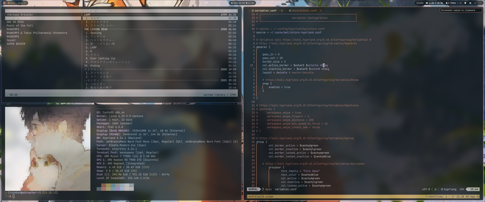

#+TITLE: Richter's Dotfiles
#+AUTHOR: MaximRichter

* Screenshots

* System

| Component    | Package                          |
|--------------+----------------------------------|
| OS           | CachyOS (Arch-based)             |
| WM           | Hyprland                         |
| Bar          | Waybar                           |
| Terminal     | Alacritty                        |
| Shell        | Fish                             |
| Editor       | Neovim / Doom Emacs              |
| Browser      | Qutebrowser                      |
| File Manager | Thunar                           |
| Launcher     | Rofi                             |
| Notifications| Mako                             |
| Music        | cmus / Yandex Music              |
| Colorscheme  | pywal16 (dynamic)                |
| GTK Theme    | adw-gtk3-dark + Gradience        |
| Qt Theme     | Kvantum (pywal)                  |
| Icon Theme   | Papirus-Dark (auto-colored)      |
| Font         | JetBrainsMono Nerd Font          |
| Cursor       | Bibata Modern Ice                |
| Wallpapers   | waypaper + color category picker |

* Features

- Dynamic colorscheme via pywal16 — everything updates on wallpaper change
- GTK3/GTK4 theming via adw-gtk3 + Gradience with pywal preset
- Qt5/Qt6 theming via Kvantum + qt6ct with pywal-generated theme
- Papirus-Dark icons auto-colored to match pywal accent on wallpaper change
- Waybar with three pill groups (left/center/right) following pywal
- Window transparency and blur via Hyprland decorations
- Gradient borders following pywal colors
- Mako notifications themed with pywal templates
- Wallpaper color category picker via rofi (~Super + W~)
- Random wallpaper keybind (~Super + Shift + W~) with automatic theme reload
- Wallpaper sorting script — automatically sorts wallpapers into color subfolders

* Requirements

** Core

#+begin_src sh
paru -S git stow hyprland waybar alacritty fish neovim rofi mako waypaper python-pywal16
#+end_src

** Theming

#+begin_src sh
paru -S adw-gtk3 gradience kvantum qt6ct qt5ct papirus-icon-theme papirus-folders python-pillow
#+end_src

** Fonts

#+begin_src sh
paru -S ttf-jetbrains-mono-nerd
#+end_src

** Full package list

A complete package list is available in the ~packages/~ directory:

#+begin_src sh
paru -S --needed - < packages/pkglist.txt
paru -S --needed - < packages/pkglist-aur.txt
#+end_src

* Installation

** 1. Clone the repo

#+begin_src sh
git clone https://github.com/MaximRichter/dotfiles ~/dotfiles
cd ~/dotfiles
#+end_src

** 2. Stow dotfiles

#+begin_src sh
stow --target=$HOME .
#+end_src

** 3. Fix hardcoded username

A few files reference ~/richter~ as the username and need to be updated manually:

#+begin_src sh
sed -i 's/richter/yourusername/g' ~/.config/waybar/style.css
#+end_src

** 4. Install pywal16-libadwaita templates

#+begin_src sh
git clone https://github.com/eylles/pywal16-libadwaita ~/.local/share/pywal16-libadwaita
cd ~/.local/share/pywal16-libadwaita
make install
#+end_src

** 5. Generate initial colorscheme

#+begin_src sh
wal --cols16 lighten -i ~/dotfiles/wallpapers/street_dusk.png
#+end_src

** 6. Apply GTK theme

#+begin_src sh
gsettings set org.gnome.desktop.interface gtk-theme 'adw-gtk3-dark'
gsettings set org.gnome.desktop.interface icon-theme 'Papirus-Dark'
#+end_src

** 7. Apply Gradience preset

#+begin_src sh
mkdir -p ~/.var/app/com.github.GradienceTeam.Gradience/config/presets/user/
bash ~/.local/share/pywal16-libadwaita/scripts/apply-theme.sh
gradience-cli apply -p ~/.var/app/com.github.GradienceTeam.Gradience/config/presets/user/pywal.json --gtk both
#+end_src

* Keybinds

| Keybind                  | Action                    |
|--------------------------+---------------------------|
| Super + Return           | Terminal                  |
| Super + E                | File manager              |
| Super + B                | Browser                   |
| Super + D                | Discord                   |
| Super + M                | Emacs                     |
| Super + T                | Telegram                  |
| Super + O                | Obsidian                  |
| Super + Space            | App launcher              |
| Super + W                | Waypaper GUI              |
| Super + Shift + W        | Random wallpaper          |
| Super + Ctrl + W         | Wallpaper category picker |
| Super + Y                | Yandex Music              |
| Super + Q                | Close window              |
| Super + Shift + Q        | Kill window               |
| Super + Shift + M        | Exit Hyprland             |
| Super + F                | Fullscreen                |
| Super + V                | Toggle floating           |
| Super + S                | Toggle split              |
| Super + R                | Resize mode               |
| Super + G                | Toggle group              |
| Super + Shift + G        | Reset gaps                |
| Super + Shift + Y        | Pin window                |
| Super + A                | Screenshot area           |
| Super + F1               | Scratchpad terminal       |
| Super + Shift + Z        | Zoom                      |
| Super + F9               | Toggle hyprsunset         |
| Super + Ctrl + Shift + Q | Power menu                |
| Super + Shift + O        | Reload Waybar             |
| Super + H/J/K/L          | Move focus                |
| Super + Shift + H/J/K/L  | Move window               |
| Super + 1-0              | Switch workspace          |
| Super + Ctrl + 1-0       | Move window to workspace  |
| Super + Shift + 1-0      | Move window silently      |
| Super + Period/Comma     | Scroll workspaces         |
| Super + Slash            | Previous workspace        |

* Relevant links

- [[https://wiki.hyprland.org][Hyprland Wiki]]
- [[https://github.com/eylles/python-pywal16][pywal16]]
- [[https://github.com/eylles/pywal16-libadwaita][pywal16-libadwaita]]
- [[https://github.com/alexays/waybar][Waybar]]
- [[https://github.com/GradienceTeam/Gradience][Gradience]]
- [[https://github.com/tsujan/Kvantum][Kvantum]]
- [[https://www.youtube.com/watch?v=y6XCebnB9gs][Stow guide]]
